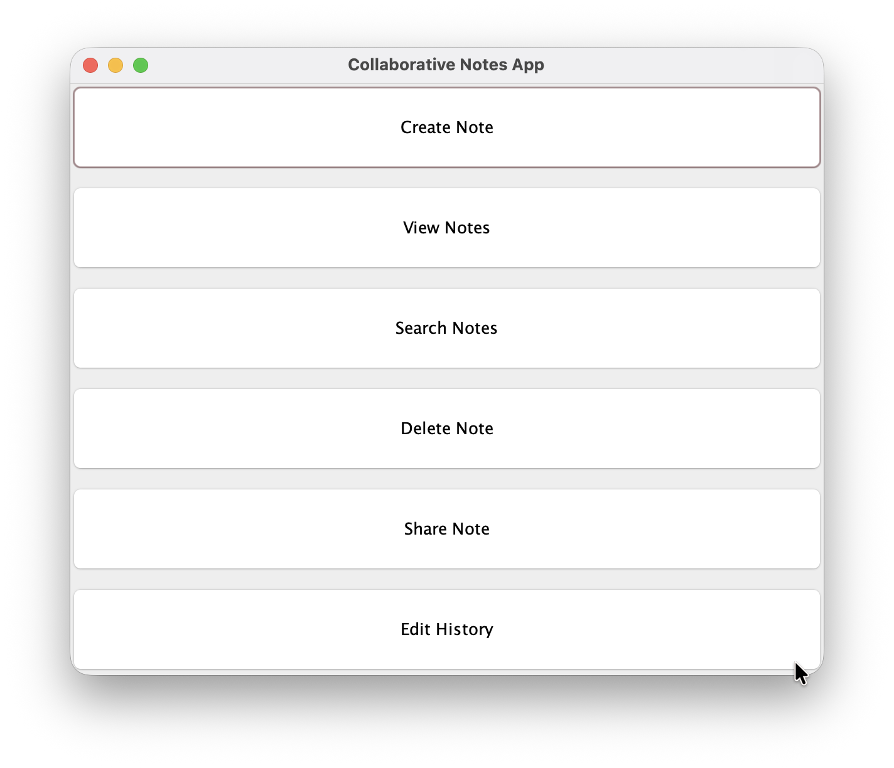
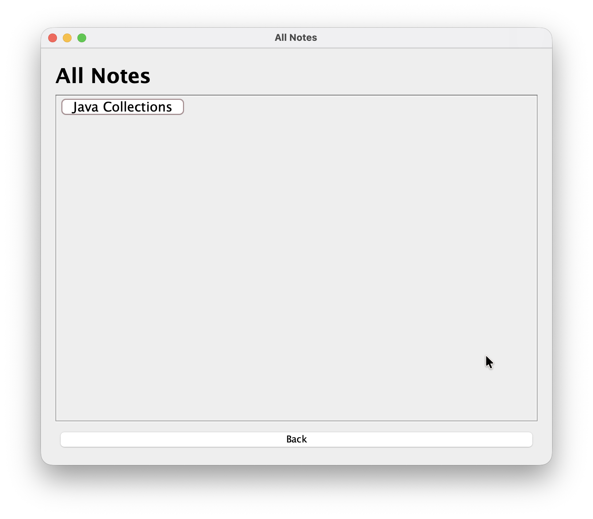

# Collaborative Notes App

A Java-based desktop notes application built using Java Swing.

## Features

- Create notes
- View notes
- Search notes
- Edit notes
- Delete notes
- Note categories
- Edit history
- Share notes
- File handling
- Exception handling

## Technologies Used

- Java
- Java Swing
- File Handling
- OOP
- ArrayList

## screenshots

### Main dashboard

### All notes

### Notes editor 

## How to Run

Compile:
javac -d bin src/*.java

Run:
java -cp bin Main